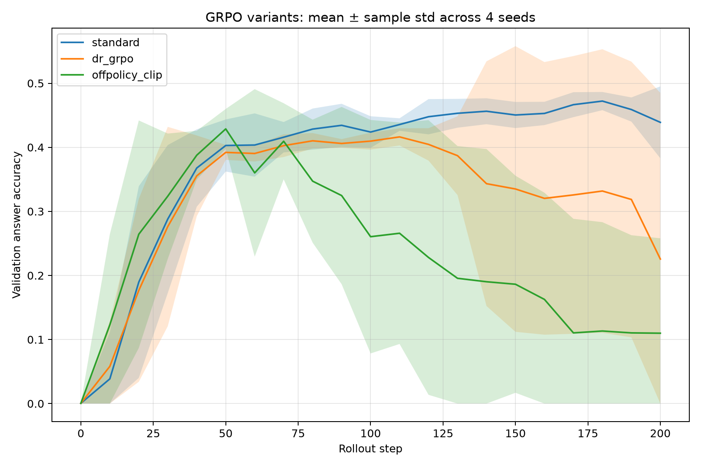
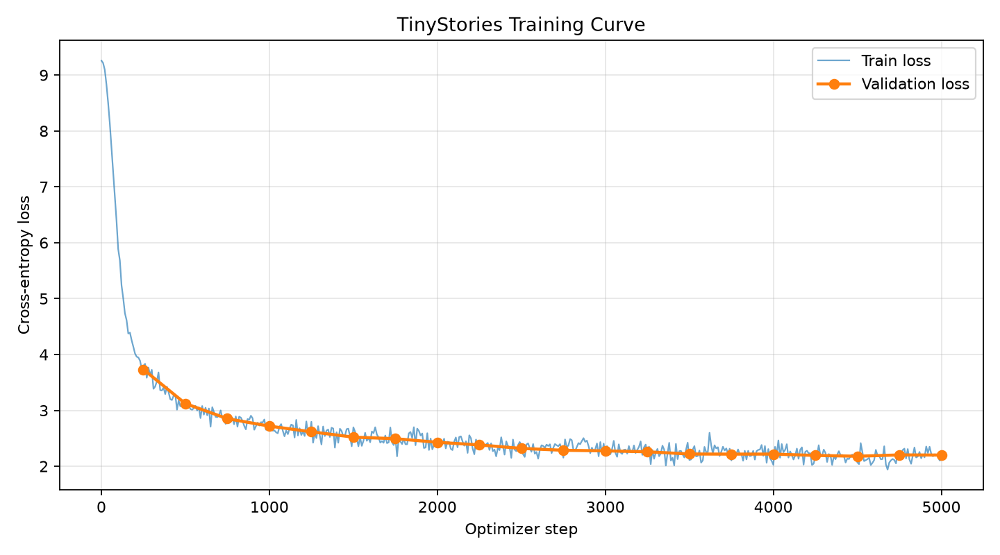

# LLM Training and Scaling

An implementation-driven study of the modern LLM training stack: Transformer training, GPU kernels, distributed optimization, compute-optimal scaling, web-data filtering, and reinforcement learning for reasoning.

The repository consolidates work from Stanford CS336 exercises into one capability-oriented codebase. The public narrative emphasizes authored implementations and measured results; upstream scaffolding and provenance are documented separately.

## Highlights

- Implemented and benchmarked standard attention and a Triton FlashAttention kernel up to sequence length 65,536.
- Trained a 14.76M-parameter Transformer end to end on TinyStories, including BPE training, binary encoding, checkpointing, generation, and loss analysis.
- Compared naive, flattened, and communication-overlapped DDP on two GPUs.
- Implemented optimizer-state sharding and FSDP with forward prefetch.
- Completed 22 language-model scaling runs across six model sizes and four compute budgets.
- Built a Common Crawl filtering pipeline with quality, toxicity, PII, and deduplication stages.
- Implemented GRPO training and compared standard GRPO, DR-GRPO, and clipped off-policy variants across four seeds.

## Measured results

| Experiment | Result |
|---|---|
| TinyStories LM | Best validation loss 2.179; perplexity 8.84 after 5,000 steps |
| 2-GPU all-reduce | 139.8 GB/s for a 1 GiB payload |
| Overlapped DDP | 438.0 ms → 360.3 ms per XL-model step (1.216×) |
| Sharded AdamW | 24.9% lower post-step allocated memory; optimizer state halved |
| FSDP prefetch | 471.4 ms → 442.2 ms per step (1.066×) |
| Triton FlashAttention | 3.48× mean forward speedup; 1.46× mean end-to-end speedup |
| Scaling sweep | Best validation loss improved from 3.864 at 1e17 FLOPs to 3.256 at 2e18 FLOPs |
| Standard GRPO | 44% mean final validation accuracy across four seeds, with no collapsed seed |





## Repository map

```text
src/llm_training_scaling/
  model/          Transformer, BPE/tokenizer, optimizer, checkpointing
  systems/        attention, Triton, DDP, optimizer sharding, FSDP
  data_pipeline/  extraction, filtering, PII masking, deduplication
  alignment/      GRPO losses, rewards, vLLM rollouts, model loading
scripts/
  training/       tokenizer, language-model, analysis, and scaling entry points
  benchmark/      throughput and multi-GPU benchmarks
  data_pipeline/  Common Crawl processing entry points
  alignment/      prompting, GRPO, and safety entry points
configs/          human-readable experiment specifications
experiments/      curated machine-readable results
figures/          publication-ready plots
tests/            original correctness tests, grouped by capability
docs/             architecture, methods, reproduction, provenance
```

## Installation

Python 3.12 is recommended.

```bash
python -m venv .venv
source .venv/bin/activate
pip install -e ".[dev,plots]"
```

Install optional components only when needed:

```bash
pip install -e ".[data]"       # Common Crawl pipeline
pip install -e ".[alignment]"  # GRPO and prompting
pip install -e ".[gpu]"        # vLLM / W&B GPU experiments
```

## Examples

```bash
# Core model tests that do not require optional data/GPU packages
pytest tests/model

# Inspect the scaling model catalog
python scripts/training/model_catalog.py

# Run the attention benchmark on a CUDA machine
python scripts/benchmark/benchmark_attention.py --help

# Run the GRPO driver
python scripts/alignment/train_grpo.py --help
```

Multi-GPU benchmarks require NCCL and should be launched according to each script's `--help`. Dataset and checkpoint paths are deliberately not committed.

See [experiment methodology](docs/experiment_methodology.md), [results](docs/results.md), [reproduction notes](docs/reproducibility.md), [file map](docs/file_map.md), and [provenance](docs/provenance.md) for details.
